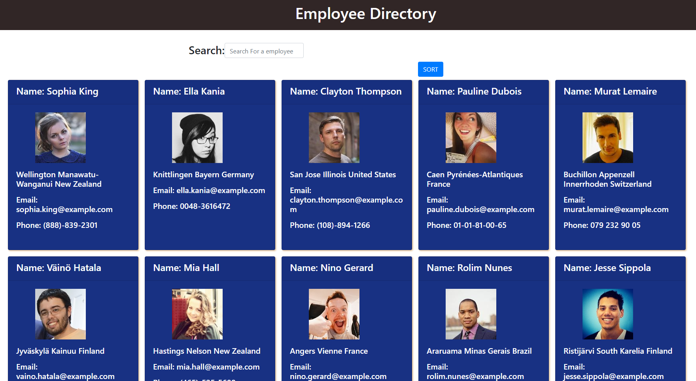
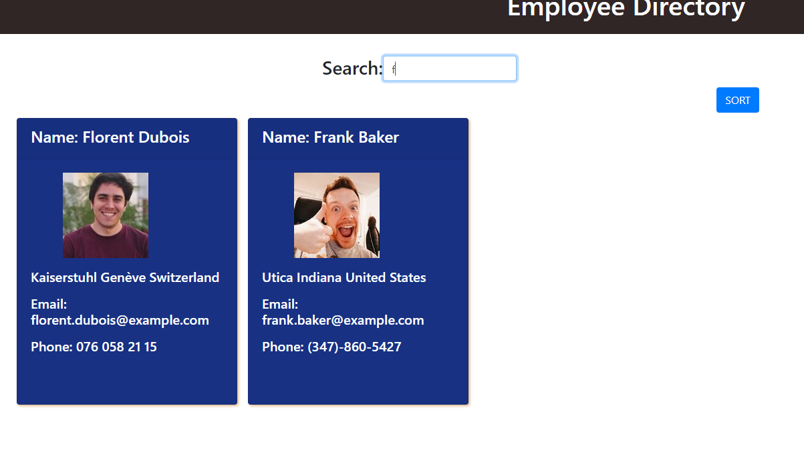

# employee-directory 
**employee-directory** is a **react.js** based simple app. As a business manager you may need to see your employee,
search your employee for quick look and you may need to arrange them in order for easier acess to all employees.
This app allows user to search employee by fist name or last name or phone number and able to arrange them in alphabetical order by employees first name.
We are not using any databases for this project so we are simulating the database by bringing the user from api call fron [random-user](https://randomuser.me/documentation#howto). Each call gives you random user on which we can work on like the regular database.

# Technologies used
- react
- axios 
- html
- css
- bootstrap

# How to start 
On command line type **npx create-react-app** app-name
after finish run the command **npm start** and visit localhost:3000 in the browser.
# test
**npm run test** run this command in terminal.

# Build
If you are planning to deplying the app then **npm build** command in command line which make your app ready to publish that is it bundles the program to run in efficent way.
# Issues
If you find any issues with this app please create an issue here:
[issues](https://github.com/ghimirear/employee-directory/issues).

# Contact
If you have any question regarding this project you can email me on 
- ghimirearjun15@gmail.com
# Deployed app 
[app](https://ghimirear.github.io/employee-directory/)
# Demo images
## All results 

## Arranged results

## Searched results 

